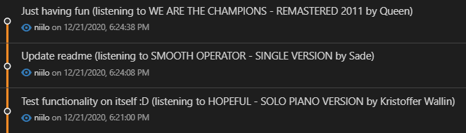

# Git commit Spotify

Automation that appends your currently playing *Spotify* track and artist information to each `git commit` message.

Unnecessary and annoying? - *Yes*

Awesome and inspiring? - *Hell yes*


Developed with Node 12.10.0

## Backend

Requires separate backend for fetching active user playback data.

Simple example can be found in /backend

## Installation

```bash
# cd target git project root
git clone git-commit-msg-spotify
cd git-commit-msg-spotify
yarn build <your spotify ID> <backend URL, e.g. http://localhost:3000>
cd ..
rm -r git-commit-msg-spotify
```



